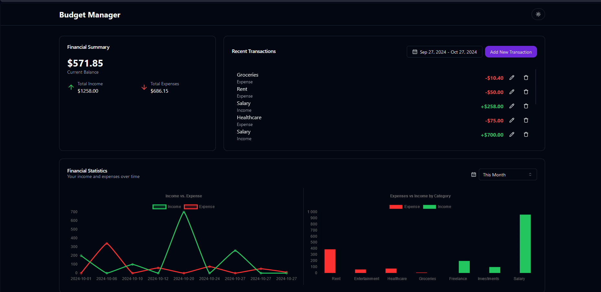

# Budget Manager

A simple and intuitive budget management application that allows users to track their income and expenses, visualize their financial data, and manage their budget effectively.



## Table of Contents

-   [Features](#features)
-   [Technologies](#technologies)
-   [Installation](#installation)
-   [Usage](#usage)
-   [Scripts](#scripts)
-   [Testing](#testing)

## Features

-   **Transaction Tracking**: Easily add and categorize income and expenses.
-   **Financial Overview**: Get a quick view of your total income, expenses, and balance.
-   **Data Visualization**: Utilize charts to visualize income and expense trends.
-   **Responsive Design**: Works seamlessly across devices with a modern interface.

## Technologies

This application is built using the following technologies:

-   Next.js
-   Tailwind
-   Typescript
-   Upstash Redis
-   React Hot Toast
-   Shadcn-ui
-   Jest and React Testing Library
-   Chart.js

## Installation

1. Clone the repository:

    ```bash
    git clone https://github.com/yourusername/budget-manager.git
    cd budget-manager
    ```

2. Install dependencies:

    ```bash
    npm install
    ```

## Usage

To start the application, you have two options depending on whether you want to use Redis or just the JSON server:

### Local Development (with JSON Server)

```bash
npm run dev
```

### Local Development (with Redis)

```bash
npm run dev-redis
```

This will start the Next.js development server and the JSON server for mock API responses.

Open your browser and navigate to `http://localhost:3000` to view the app.

## Scripts

The following scripts are available in this project:

-   `dev`: Starts the Next.js and JSON server for development without Redis.
-   `dev-redis`: Starts the Next.js server with Redis.
-   `next`: Runs the Next.js development server.
-   `server`: Starts the JSON server on port 3001.
-   `build`: Builds the application for production.
-   `start`: Starts the production server.
-   `lint`: Runs ESLint for code quality.aHere's the updated README with the **Features** and **Built with** sections formatted as you specified:

---

# Budget Manager

A simple and intuitive budget management application that allows users to track their income and expenses, visualize their financial data, and manage their budget effectively.

## Table of Contents

-   [Features](#features)
-   [Technologies](#technologies)
-   [Installation](#installation)
-   [Usage](#usage)
-   [Scripts](#scripts)
-   [Testing](#testing)

## Features

-   Track income and expenses easily
-   View total income, expenses, and balance
-   Visualize financial data with charts
-   Add and categorize transactions
-   Responsive design for mobile and desktop
-   Manage multiple transactions

## Built with

-   Next.js 15
-   TypeScript
-   Tailwind CSS
-   Chart.js
-   Upstash Redis (optional)
-   JSON Server (for local development)
-   Jest and React Testing Library

## Installation

1. Clone the repository:

    ```bash
    git clone https://github.com/yourusername/budget-manager.git
    cd budget-manager
    ```

2. Install dependencies:

    ```bash
    npm install
    ```

## Usage

To start the application, you have two options depending on whether you want to use Redis or just the JSON server:

### Local Development (without Redis)

```bash
npm run dev
```

### Local Development (with Redis)

```bash
npm run dev-redis
```

This will start the Next.js development server and the JSON server for mock API responses.

Open your browser and navigate to `http://localhost:3000` to view the app.

## Scripts

The following scripts are available in this project:

-   `dev`: Starts the Next.js and JSON server for development without Redis.
-   `dev-redis`: Starts the Next.js server with Redis.
-   `next`: Runs the Next.js development server.
-   `server`: Starts the JSON server on port 3001.
-   `build`: Builds the application for production.
-   `start`: Starts the production server.
-   `lint`: Runs ESLint for code quality.
-   `test`: Runs Jest tests.

## Testing

To run tests, use the following command:

```bash
npm test
```

Make sure you have all the necessary test dependencies installed.

## Contributing

Contributions are welcome! Please feel free to submit a pull request or open an issue if you have suggestions or improvements.

## License

This project is licensed under the MIT License. See the LICENSE file for more details.

---

Feel free to adjust any details or add additional sections as needed!

-   `test`: Runs Jest tests.

## Testing

To run tests, use the following command:

```bash
npm test
```

Make sure you have all the necessary test dependencies installed.
